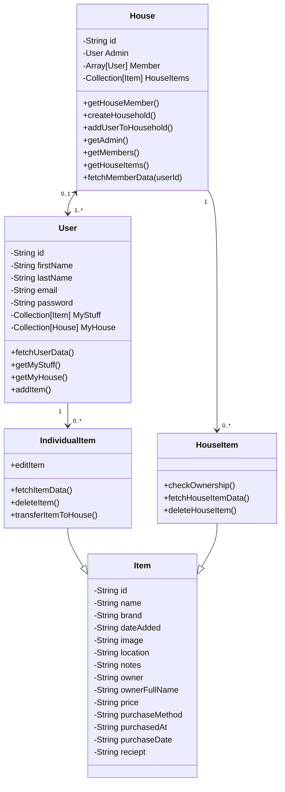
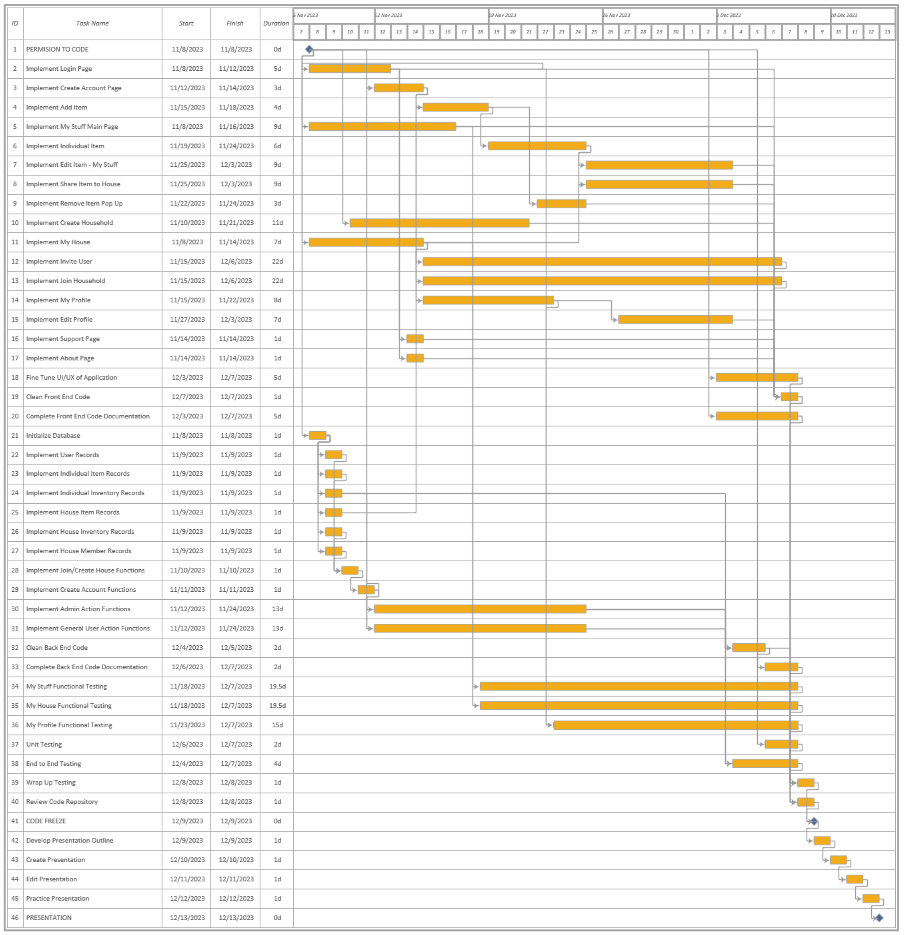

# CS5520 Final Project - Avengers
**Members: Andrew Moran, Jiyu He, Kabila Williams, Steve Chen**

## 1. Purpose  

### 1. Definitions  
  
1. User – An individual who has a registered and owns an account within the application  

2. Household – A collection of Users that all live in the same shared space.  

3. Inventory – A list of items owned by a user, complete with detailed information about each item.  

4. Admin User /Host – The User who establishes a Household will assume the role of Admin, possessing access to household and member management.  

### 2. Background 

1. In a shared living situation, it is important to be able to discern what belongs to who while also keeping track of one’s own belongings. While there are many applications in the marketplace to deal with the coordination of chores and splitting of bill for roommate situations, the only applications in the marketplace for tracking individual belongings are geared towards older adults that live in single family housing or those who are managing multiple properties. This application will be able to address a potentially contentious area of shared living that doesn’t have many tools currently available, while simultaneously providing an avenue for young adults to start the crucial habit of documenting their belongings, something that people usually don’t do until it's too late.  

## 2. Overall Description  

### 1. User Characteristics  

1. Digital native young adults (ages 18 to 25) that rely on their mobile device as their main computing device and currently reside or plan to move into shared housing. Shared housing situations include but aren’t limited to a dorm room, house, or apartment where multiple roommates share common areas (such as the living room, bathroom and kitchen). 

2. Technologically savvy, forward-thinking adults (ages 26 to 99) who want a secure, reliable tool to add, remove, and update the contents of their home.

### 2. User Stories  

1. As a college student, I want to easily document my stuff when moving into a dorm, so that I can keep track of my personal belongings. 

2. As a house owner, I want to document and take photos of my personal property, so that I can keep track of the original price I paid for each item and the quantity of items purchased in case anything is damaged or needs to be replaced. 

3. As an inventory app user, I want the ability to share my inventory list with other members of the household, so that we may all be in agreement about who can claim primary ownership of shared household items. 

4. As a resident of an assisted living facility (ALF), I want the ability to retrieve an organized list of my personal belongings that I’ve selected to bring with me. 

### 3. App Workflow  

The app workflow is presented in three segments, these segments being My Stuff, My House, and My Profile, to make it easier to see and to demonstrate the three separate segments that this application combine together. Each of these sections has an entry point from the bottom menu bar that is located on each of the pages in the app so that the user can seamlessly jump between these segments as they need.

App Workflow Diagram Legend  
  
My Stuff Section, App Workflow Diagram  
  
My House, App Workflow Diagram  
  
My Profile Section, App Workflow Diagram  
  

## 3. Requirements  

### 1. Core-functional  

1. **Create an account as an individual user.** The user can create a secure account where they have exclusive access to the data. The user's name and shared items are available for other users to see in a shared housing situation. 

2. ***Host*** **a household.** A household can be created that has 1 or more individual users associated with it. A user can *host* a household and become an admin/host, accessing the ability to invite other users to join the house. 

3. **Create private inventory –** ***My Stuff.*** Create a private inventory list to document items owned by the user. 

4. **Add items.** Through text input, the user can provide a brief description of their personal items and upload supporting documents if needed (such as receipts and a photograph of the item from their mobile device). 

5. **Manage items.** After creating an item in the *My Stuff* list, user can access item management from a drop-down menu to *Edit Item*, *Share to House*, and *Remove Item*. 

6. **Filter** ***My Stuff.*** Using filters to sort the private inventory by *item location*. 

7. **Share private items with household.** Items owned by an individual user (on the *My Stuff* list) can be shared to the household inventory. Other users in this household can access the information of this item. 

8. **Household inventory –** ***My House.*** A list of all household items that have been marked as shared by an individual user, which can be accessed by all users in the same household.  

9. **Household management – member addition.** A guided onboarding process for adding an individual user account to an existing household. Employs a QR code uniquely generated for each session. The pairing process is secured using a hash value derived from the household identifier and the current timestamp, ensuring a robust and time-sensitive connection. 

10. **Household item management.** Items in the household inventory can only be removed by the owner of that item or the Admin of the house.

11. **Filter** ***My House.*** Using filters to sort the shared inventory by ownership and location (rooms). 

12. **Account Management – My Profile.** Users can change their displaying name in account management page, and other information pages. Max user number in a House is 6 for the initial version. 

### 2. Nice-to-Have Functional  

**These Nice-to-Have Functional requirements were not able to be incorporated into the current release, but will be reserved for future releases.**

1. **Export Inventory.** Export a simplified file version of the inventory to the user’s local device, in formats like JSON, CSV, or even pdf.  

2. **Google ML.** Implement Google ML and add additional features to improve user experience.  

  1. **Photo object detection & tracking.** Helps to prefill the *add-item* form. When the camera captures an object and detects the name, user can choose to continue to add this item (with the detected name and the image) or add by manual input instead.  

### 3. Non-Functional  

1. **Responsiveness.** When members of the household access the list of household items, the app should display the list within ***3 second***, reflecting the performance of local data retrieval. 

2. **App Performance.** Overall app performance should allow for immediate data retrieval and processing, with any action initiated by the user (such as fetching, sorting, or updating data) completed within ***4 seconds*** on the supported device range. 

3. **Access Security.** The app implements robust access control mechanisms to ensure the inventories accessibility to proper users. 

  1. **Private User Data Protection.** Ensure that private inventories are exclusively accessible by their respective owners. 

  2. **Secure Pairing**: Pairing with a household must strictly require the correct invitation QR code. The system should reject any pairing attempt without a valid QR code. 

4. **User-Friendly Interface.** Provide user-friendly widgets and pass all tests related to accessibility standards. 

5. **Maintainability.** Architecture should be designed to allow for straightforward maintenance and testing. Unit test coverage be more than 75%, ensuring ease of debugging. The system be enabled to integrate new features with no more than 20% modification to existing components, facilitating future updates 

6. **Data Synchronization.** When multiple members of a household are viewing the same inventory list, changes made by one member should be visible to others within ***10 seconds*** to ensure data consistency and real-time experience. 

## 4. Wireframes  

Welcome page for logging in and the Create Account Pages  
  

My Stuff Page  
  

Add Item Page  
  

View Individual Item Page  
  

Edit Individual Item Details Page  
  

Create Household Page along with the Join and Invite Pages used to Join a Household
  

My House Page    
  

View Household Individual Item Page  
 

My Profile and Edit Profile Pages  
 

Application Support and About Pages  
 

## 5. UML Class Diagram  

## 6. Gantt Chart  

The Gantt Chart covers the project from the point that permission was given to start coding all the way to the final presentation of the application.

  

## 7. Traceability Matrix  

| Requirement ID | Requirement Description | Requirement Type | Test Case ID | Test Description | Status |  
| :-------- | :------- | :------- | :--------- | :------- | :------- |  
| CFR1 | Create an account as an individual user. | Core-functional  | TC01 | Verify account creation with unique email and secure password. | Passed |  
| CFR2 | Host a household.  | Core-functional  | TC02 | Verify a user can link itself with a household object and become an admin/host, accessing related methods. | Passed |  
| CFR3 | Create private inventory | Core-functional  | TC03 | Verify a user can create only one private inventory as MyStuff.  | Passed |  
| CFR4 | Add item to private inventory  | Core-functional  | TC04 | Verify a user can access the addItem() method to the MyStuff list associated with the user. | Passed |  
| CFR5 | Manage item in private inventory | Core-functional  | TC05 | Verify a user can access the editItem(), shareToHouse(), and removeItem() methods to the MyStuff list associated with the user. All related button widgets are displaying properly.  | Passed |  
| CFR6 | Filters in private inventory  | Core-functional  | TC06 | Verify the sorting methods related to the private inventory and displays properly. | Passed |  
| CFR7 | Share private items with household  | Core-functional  | TC07 | The shareToHouse() method will transfer the item from the private list to the house list. | Passed |  
| CFR8 | Household Inventory | Core-functional  | TC08 | Verify the list of the shared items in the house are retrieved and displaying properly.  | Passed |  
| CFR9 | Household Item Removal  | Core-functional  | TC09 | Verify that only the owner and admin can remove the item and that the item is still located in the owners personal inventory. All related widgets are displaying properly. | Passed |  
| CFR10-1 | QR-code generation  | Core-functional  | TC10-1 | Verify the QR code are generated for each session, validating the QR code requires a hash derived from the household identifier and timestamp.  | Passed |  
| CFR10-2 | Guided onboarding for adding users.  | Core-functional  | TC10-2 | Testing the onboarding process to pair a host account and an invited new user using QR code, then add the new user to the house object. | Passed |  
| CFR11 |  Household management – User View   | Core-functional  | TC11 |  Verify that within the household a standard user does not have the ability to invite others. All related widgets are displaying properly.  | Passed |  
| CFR12 |  Household management – Admin/host View   | Core-functional  | TC12 |  Verify a host/admin can access the ability to invite members. All related widgets are displaying properly.  | Passed |  
| CFR13 |  Profile Page  | Core-functional  | TC13 |  Verify the users can access methods to modify their displaying name. Widgets linked to the information pages are displaying properly.  | Passed |  
| NFR1 |  Responsiveness.  | Non-functional  | TC14 |  Check that the item list displays within 3 second.   | Passed |  
| NFR2 |  App Performance   | Non-functional  | TC15 |  Check that actions initiated by the user (such as fetching, sorting, or updating data) are completed within 4 seconds.  | Passed |  
| NFR3-1 |  Security - Private User Data Protection   | Non-functional  | TC16-1 |  Verify access control mechanisms restrict inventory to owner users.  | Passed |  
| NFR3-2 |  Security - Secure Pairing  | Non-functional  | TC16-2 |  Verify QR code pairing with a household only accepts valid QR code.   | Passed |  
| NFR4 |  Accessibility   | Non-functional  | TC17 |  Pass all tests related to accessibility standards.  | Passed |  
| NFR5 |  Architecture maintainability and testing  | Non-functional  | TC18 |  Verify that unit tests cover more than 75% of the codebase.   | Competed tests but issue getting accurate coverage measurement |  
| NFR6 |  Data synchronization  | Non-functional  | TC19 |  Test that changes in the inventory list by one user are visible to all other users within 10 seconds.  | Passed |  
