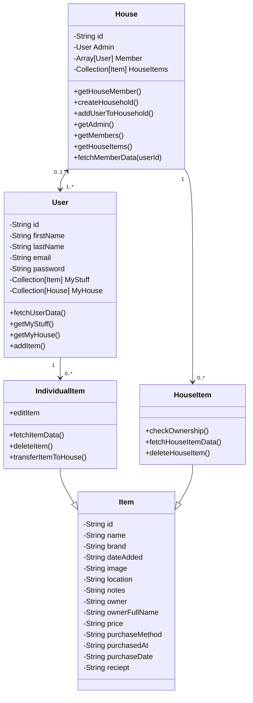

```mermaid
classDiagram
    class IndividualItem {
        +fetchItemData()
        +deleteItem()
        +transferItemToHouse()
        +editItem
    }
    class HouseItem {
        +checkOwnership()
        +fetchHouseItemData()
        +deleteHouseItem()
    }
    class Item {
        -String id
        -String name
        -String brand
        -String dateAdded
        -String image
        -String location
        -String notes
        -String owner
        -String ownerFullName
        -String price
        -String purchaseMethod
        -String purchasedAt
        -String purchaseDate
        -String reciept
    }
    class House {
        -String id
        -User Admin
        -Array[User] Member
        -Collection[Item] HouseItems
        +getHouseMember()
        +createHousehold()
        +addUserToHousehold()
        +getAdmin()
        +getMembers()
        +getHouseItems()
        +fetchMemberData(userId)
    }  
    class User {
        -String id
        -String firstName
        -String lastName
        -String email
        -String password
        -Collection[Item] MyStuff
        -Collection[House] MyHouse
        +fetchUserData()
        +getMyStuff()
        +getMyHouse()
        +addItem()
    }
    House "1" --> "0..*" HouseItem
    House "0..1"<-->"1..*" User
    User "1"-->"0..*" IndividualItem
    IndividualItem --|> Item
    HouseItem --|> Item
```

